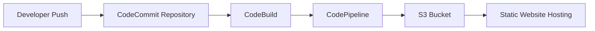

# 🚀 DevOps Mentor Hub — Static React Website with AWS CI/CD

Your complete guide to deploying React apps using AWS CodePipeline, CodeBuild, CodeCommit, and S3.

## ✨ Project Overview

A sleek, production-optimized static React website designed to:

- ✅ Showcase CI/CD workflow knowledge.
- ✅ Be deployed automatically using AWS services.
- ✅ Serve as a portfolio or mentoring hub.

**Built With:**  
React + Vite + Tailwind CSS  
AWS CodePipeline, CodeBuild, CodeCommit  
S3 Static Website Hosting  
Framer Motion Animations

## 📂 Architecture Flow



## 🛠️ Tech Stack

| Tech             | Purpose                  |
|------------------|-------------------------|
| React, Vite      | Frontend UI             |
| Tailwind CSS     | Styling                 |
| AWS S3           | Static Website Hosting  |
| AWS CodePipeline | CI/CD Pipeline          |
| AWS CodeBuild    | Build & Deploy Scripts  |
| AWS CodeCommit   | Git Repository          |

## 📚 Learning Journey Steps

1. **Git & CodeCommit** → Initialize project repository.
2. **CodeBuild** → Configure build process using `buildspec.yml`.
3. **CodePipeline** → Automate deploy workflow.
4. **S3 Hosting** → Serve the built app publicly.

## ✅ How to Create This Project (Step by Step)

1. **Clone this repository**
     ```sh
     git clone https://github.com/arpitshukla9/aws-cicd-pipeline.git
     ```

2. **Install dependencies:**
     ```sh
     npm install
     ```

3. **Build locally (test):**
     ```sh
     npm run build
     ```

4. **Push to AWS CodeCommit repository** (connected via CodePipeline).

5. **AWS CodeBuild executes using this `buildspec.yml`:**

     ```yaml
     version: 0.2

     phases:
         install:
             runtime-versions:
                 nodejs: 18
             commands:
                 - npm install
         build:
             commands:
                 - npm run build
     artifacts:
         base-directory: dist
         files:
             - '**/*'
     ```

6. Static files get automatically deployed to S3 Bucket.

7. S3 Bucket is configured as a static website with public access enabled.

## 🌐 Live Preview

You can host it at:  
`https://your-bucket-name.s3-website-<region>.amazonaws.com/`

## 🧑‍💻 Mentors & Contributors

- **Shresth Sahai** — CI/CD Mentor
- **Coding Blocks** — Learning Platform
- **Garvit Doehere** — DevOps Guide

## ⚙️ License

This project is licensed under the MIT License.
